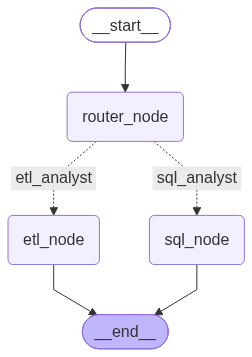
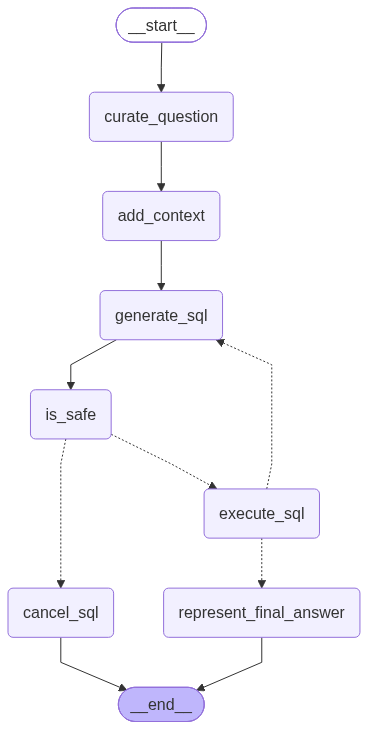

# Data Agent

An AI data analyst that turns a plain-English question into a validated SQL query, an automatically-cleaned dataset, or a rendered chart — with the safety boundary enforced by the database itself, not by trusting the model.

```
python main.py "which industries pay the most for happy employees?"
```

## Why this exists

Most "AI writes SQL for you" demos stop at the happy path: type a question, get a query back, done. This project is about everything that has to be true *before* that's actually safe to run against real data — a deterministic safety gate the model can't talk its way around, a database role that's physically incapable of writing, and a data-cleaning pipeline that never applies a fix without a human seeing the generated code first.

## Architecture

A router classifies each request and dispatches it to one of two specialized agents. Visualization isn't a third agent — it's the same SQL agent, asked to keep going after it has an answer.

<p align="center"></p>

The SQL agent is a stateful LangGraph: curate the question, build schema context, generate SQL, gate it, execute it, answer it — with an auto-clean redirect if the target table is known to have data-quality problems.

<p align="center"></p>

## What makes this different from a naive text-to-SQL agent

- **The safety boundary is the database, not the model.** `app_reader`, the role every query runs under, has write access revoked at the Postgres level — `INSERT`/`UPDATE`/`DELETE`/`TRUNCATE`/`CREATE` are gone. An LLM-as-judge check runs too, but it's a secondary opinion; a deterministic AST parser (`sqlglot`) is what actually decides whether a query is safe, and it's regression-tested to prove the LLM is never even consulted for an obviously unsafe query.
- **Generated cleaning code never runs unreviewed.** The cleaning pipeline detects issues (a fixed rubric plus an LLM discovery pass that proposes hypotheses which are then mechanically verified against every real value — never trusted on the model's word alone), but every fix it generates is shown to a human before it executes.
- **A retry loop can't pressure the model into fabricating a fix.** When a generated fix doesn't structurally match what was expected, the natural instinct is to feed the failure back and ask again — but that can quietly pressure a model into gaming the check instead of admitting the fix doesn't apply. Two specific fix types (composite-field splitting, range decomposition) have an explicit "this doesn't apply" decline path that's treated as a *successful* outcome, never retried.
- **Judgment calls are separated from correctness fixes.** Deduplicating rows or fixing a wrong data type has one right answer, so it's automatic (with human sign-off). Deciding how to bucket 57 raw industry values into a handful of categories is a judgment call, so it lives in a separate, opt-in phase — cached once it's decided, and pinnable to a cited reference file (Manual Mode) instead of being re-derived by an LLM every time.
- **Every run is a durable, replayable record.** Every question, its SQL, its result, and its final answer are logged. A report or slideshow can be regenerated from that log after the fact — no need to re-run the question.

## Quickstart

```bash
uv sync
```

Create `~/.hermes/profiles/data-agent/.env` with:

```
PG_HOST=localhost
PG_PORT=5432
PG_DATABASE=postgres
PG_ADMIN_USER=<a postgres superuser role>
PG_APP_READER_USER=app_reader
PG_APP_READER_PASSWORD=<a strong password>
ANTHROPIC_API_KEY=<your key>
```

`app_reader` must be created as a real Postgres role with **only** `SELECT` on `public` and `USAGE` on the schema — see `AGENTS.md` for the exact `REVOKE` statements. This is the actual security boundary; it is not optional.

Load the sample dataset:

```bash
uv run python utils/load_data.py data/data-science-jobs
```

Ask it something:

```bash
uv run python main.py "what's the average salary for data scientists in the tech industry?"
```

## Other commands

Beyond a plain question, `main.py` understands a few standing commands — none of these touch the router, they're handled directly:

| Command | What it does |
|---|---|
| `"report: <question>"` / `"report last"` | Build an HTML report narrating a run's full walkthrough — cleaning, transformation decisions, and analysis. |
| `"present: <question>"` / `"present last"` | Same walkthrough, rendered as an HTML slideshow. |
| `"map"` | Regenerate the three architecture diagrams above from the real, current code — never a stale hand-drawn picture. |
| `"dictionary: <table>"` | A one-page reference for a table: row count, quality status, and every column's type, key role, and whether it's derived. |
| `"dq backlog"` | Every table with an outstanding data-quality issue, worst first. |
| `"compare: <question>"` | Diff the two most recent runs of the exact same question — did the SQL, the results, or the answer change? |
| `"freshness"` | Check every tracked table's real source file for drift since it was last processed. |

## Project layout

```
agents/       LangGraph node definitions — the router, the SQL analyst, the ETL analyst
utils/        Cleaning, transformation, database, and reporting logic (no LangGraph dependency)
models/       Pydantic state schemas shared across the graphs
tests/        Standalone test scripts (not pytest) — see "Testing" below
scripts/      One-off analysis scripts built on top of the agent's own output
data/         Sample datasets and test fixtures
```

## Testing

Tests are standalone scripts, not a pytest suite:

```bash
PYTHONPATH=$(pwd) uv run python tests/test_<name>.py
```

Most require a live Postgres with the sample data loaded; a few (safety-gate, SQL parsing, system-map generation) need neither a database nor a live LLM call, and say so in their own docstrings.

## License

MIT — see [LICENSE](LICENSE).
